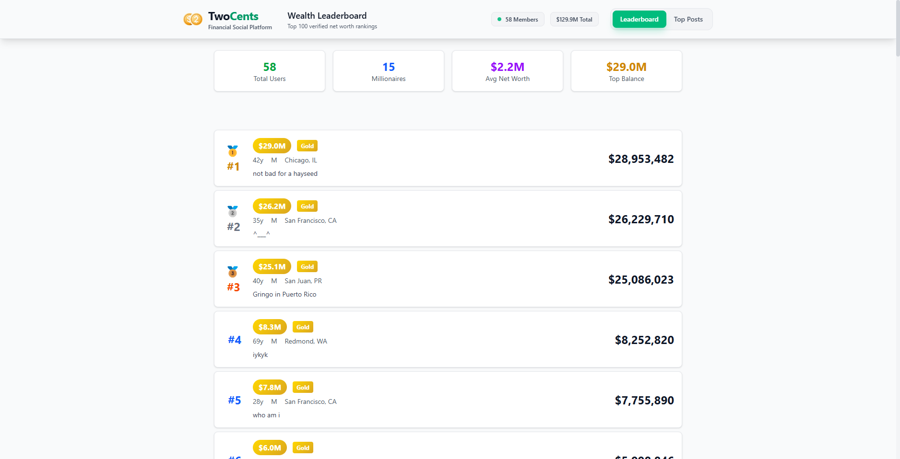
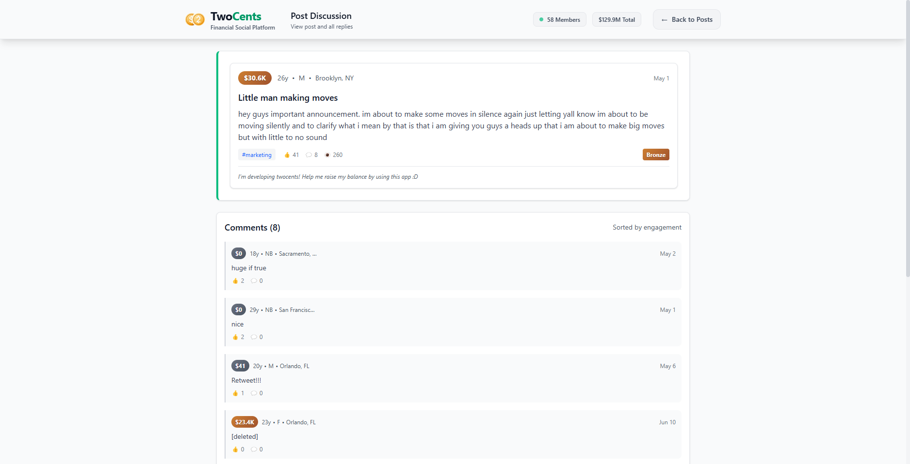

# TwoCents Social Network - Technical Challenge

A React implementation of the TwoCents anonymous social network home page feed, where your username is your net worth.

## About TwoCents

TwoCents is an anonymous social network where users' usernames are their net worth. This project rebuilds the home page feed showing the top posts with the ability to view post details and comments.

## Screenshots

### Leaderboard View


### Post Discussion


### Top Posts Feed


## Features

- **Top Posts Feed**: Display the top 100 posts in a scrollable list
- **Post Details**: Click on any post to view detailed discussion with comments
- **Net Worth Pills**: Display user net worth with bronze/silver/gold/platinum styling
- **User Information**: Show age, gender, and location for post authors
- **Responsive Design**: Works across multiple screen widths and heights
- **Anonymous Social Network**: Username based on net worth

## API Integration

This project integrates with the TwoCents API hosted at `https://api.twocents.money` using JSON-RPC 2.0 specification.

Key API endpoints used:
- Get top posts feed
- Get individual post details
- Get comments for posts
- Get user information
- Get poll results (when applicable)

## Tech Stack

- **React.js** - Frontend framework
- **Vite** - Build tool and development server
- **Tailwind CSS** - Styling (as per challenge requirements)
- **JSON-RPC 2.0** - API communication protocol

## Installation & Setup

1. Clone the repository:
```bash
git clone <repository-url>
cd tmp_money
```

2. Install dependencies:
```bash
npm install
```

3. Start the development server:
```bash
npm run dev
```

4. Open your browser and navigate to `http://localhost:5173`

## Challenge Requirements

This project was built as part of the TwoCents technical challenge with the following specifications:

### Core Requirements
- ✅ Display top 100 posts in a list format
- ✅ Click on posts to view detailed discussion
- ✅ React.js with Tailwind CSS
- ✅ Responsive design for multiple screen sizes
- ✅ Integration with TwoCents API using JSON-RPC 2.0

### Bonus Features
- Net worth pills with bronze/silver/gold/platinum gradients
- Post author information (age, gender, location)
- Nested comment indentation
- Poll results visualization
- Clickable net worth pills for user profiles
- Graceful handling of unsupported post types

## Project Structure

```
tmp_money/
├── src/
│   ├── App.jsx          # Main application component
│   ├── App.css          # Application styles
│   └── main.jsx         # Application entry point
├── screenshots/         # UI screenshots
├── public/             # Static assets
└── README.md           # Project documentation
```

## Development

This project uses Vite for fast development and hot module replacement (HMR). ESLint is configured for code quality.

### Available Scripts

- `npm run dev` - Start development server
- `npm run build` - Build for production
- `npm run preview` - Preview production build
- `npm run lint` - Run ESLint

## API Reference

The application communicates with the TwoCents API using JSON-RPC 2.0. Example requests include:

```javascript
// Get top posts
{
  "jsonrpc": "2.0",
  "method": "/v1/posts/top",
  "params": {},
  "id": 1
}

// Get post details
{
  "jsonrpc": "2.0", 
  "method": "/v1/posts/get",
  "params": {"post_uuid": "uuid-here"},
  "id": 2
}
```

## Contributing

This is a technical challenge implementation. For questions or clarifications about the TwoCents platform, visit:
- [TwoCents Website](https://twocents.money)
- [TwoCents on X](https://x.com/twocentinc)

---

*Built as part of the TwoCents technical challenge - demonstrating React.js development skills and API integration capabilities.*
